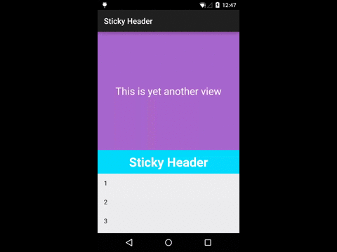

Android RecyclerView Sticky Header
===



This is a really simple way to add a sticky header in Android' s new widget, the RecyclerView which comes from the support library.

Please take a look at the code, it won' t take long.


```
The MIT License (MIT)

Copyright (c) 2015 longkai

The software shall be used for good, not evil.
```
